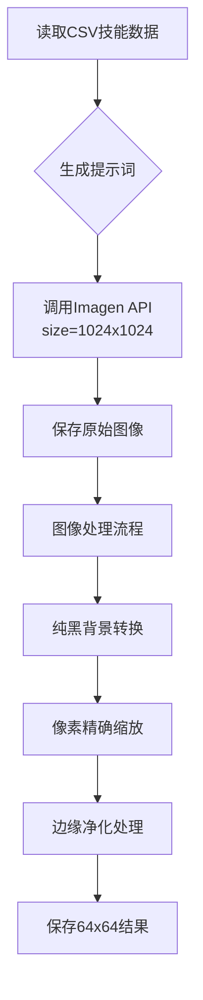

### 解决方案（更新版）

#### 1. 提示词优化（关键修改）
```diff
Pixel art skill icon, retro 16-bit style,
-blocky pixel clusters,
+ultra-detailed pixel clusters,
clean central composition,
-solid black background,
+pure black background (#000000),
no decorative borders, no text, no stars, no level numbers, no element symbols,
-minimalistic design, sharp edges, no anti-aliasing
+minimalistic design, razor-sharp edges, no anti-aliasing, no transparency
```

#### 2. 图像处理流程升级
```python
from PIL import Image

def process_image(input_path, output_path):
img = Image.open(input_path)

# 强制转换为RGBA处理透明通道
if img.mode != 'RGBA':
img = img.convert('RGBA')

# 创建纯黑背景（覆盖透明区域）
black_bg = Image.new('RGBA', img.size, (0, 0, 0, 255))
black_bg.paste(img, (0, 0), img)# 使用原图alpha通道

# 转换为RGB模式移除透明通道
final_img = black_bg.convert('RGB')

# 像素精确缩放（关键修改）
resized = final_img.resize((64, 64), Image.NEAREST)

# 二次边缘处理（消除残留白边）
pixels = resized.load()
for x in range(resized.width):
for y in range(resized.height):
# 将近似黑色的边缘转为纯黑
r, g, b = pixels[x, y]
if r > 10 or g > 10 or b > 10:# 非黑色像素
# 检查是否边缘像素
if x == 0 or y == 0 or x == resized.width-1 or y == resized.height-1:
pixels[x, y] = (0, 0, 0)

resized.save(output_path, "PNG")
```

#### 3. API参数关键调整
```python
payload = {
"prompt": optimized_prompt,
"size": "1024x1024",# 生成大尺寸源文件
"quality": "ultra-detail",
"style_strength": 0.95,# 增强风格一致性
"steps": 60,
"negative_prompt": "text, numbers, stars, borders, UI elements, decorations, transparency, alpha channel",
"output_format": "png"# 明确要求PNG格式
}
```

### 完整工作流优化



### 测试验证方案
1. **边缘检测测试**
```python
def test_black_background(image_path):
img = Image.open(image_path)
for pixel in img.getdata():
if pixel != (0, 0, 0):# 发现非黑像素
return False
return True
```

2. **尺寸验证**
```python
assert img.size == (64, 64)
```

3. **像素风格验证**
```python
# 检查是否包含抗锯齿
for x in range(img.width-1):
for y in range(img.height-1):
if img.getpixel((x, y)) != img.getpixel((x+1, y)):
# 相邻像素颜色突变是像素风格特征
break
```

### 最终配置建议
```ini
[API]
size = 1024x1024
style_strength = 0.95
steps = 60

[Processing]
output_size = 64
edge_clean_threshold = 10# RGB值>10视为非黑